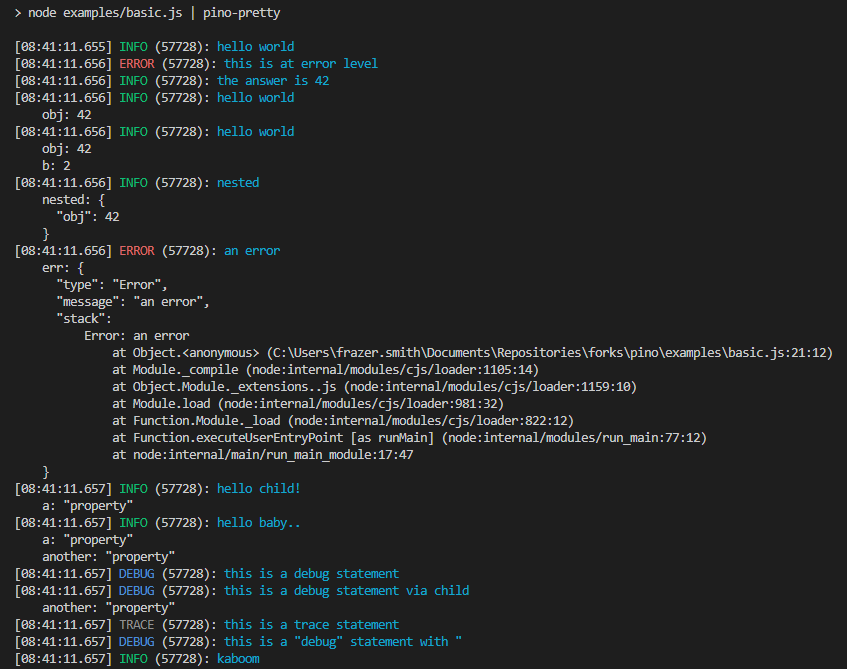

# plno-logger
[](https://www.npmjs.com/package/plno-logger)
[](https://github.com/laurabenton/plno-logger/actions)
[](https://standardjs.com/)

[Very low overhead](#low-overhead) JavaScript logger.

## Documentation

* [Benchmarks ⇗](/docs/benchmarks.md)
* [API ⇗](/docs/api.md)
* [Browser API ⇗](/docs/browser.md)
* [Redaction ⇗](/docs/redaction.md)
* [Child Loggers ⇗](/docs/child-loggers.md)
* [Transports ⇗](/docs/transports.md)
* [Diagnostics ⇗](/docs/diagnostics.md)
* [Web Frameworks ⇗](/docs/web.md)
* [Pretty Printing ⇗](/docs/pretty.md)
* [Asynchronous Logging ⇗](/docs/asynchronous.md)
* [Ecosystem ⇗](/docs/ecosystem.md)
* [Help ⇗](/docs/help.md)
* [Long Term Support Policy ⇗](/docs/lts.md)

## Runtimes

### Node.js

Pinox is built to run on [Node.js](http://nodejs.org).

### Bare

Pinox works on [Bare](https://github.com/holepunchto/bare) with the [`pino-bare`](https://github.com/pinojs/pino-bare) compatibility module.

### Pear

Pinox works on [Pear](https://docs.pears.com), which is built on [Bare](https://github.com/holepunchto/bare), with the [`pino-bare`](https://github.com/pinojs/pino-bare) compatibility module.


## Install

Using NPM:
```
$ npm install plno-logger
```

Using YARN:
```
$ yarn add plno-logger
```

## Usage

```js
const logger = require('plno-logger')()

logger.info('hello world')

const child = logger.child({ a: 'property' })
child.info('hello child!')
```

This produces:

```
{"level":30,"time":1531171074631,"msg":"hello world","pid":657,"hostname":"Davids-MBP-3.fritz.box"}
{"level":30,"time":1531171082399,"msg":"hello child!","pid":657,"hostname":"Davids-MBP-3.fritz.box","a":"property"}
```


<a name="essentials"></a>
## Essentials

### Development Formatting

The [`pino-pretty`](https://github.com/pinojs/pino-pretty) module can be used to
format logs during development:



### Transports & Log Processing

Due to Node's single-threaded event-loop, it's highly recommended that sending,
alert triggering, reformatting, and all forms of log processing
are conducted in a separate process or thread.

In Pinox terminology, we call all log processors "transports" and recommend that the
transports be run in a worker thread using our `plno-logger.transport` API.

For more details see our [Transports⇗](docs/transports.md) document.

### Low overhead

Using minimum resources for logging is very important. Log messages
tend to get added over time and this can lead to a throttling effect
on applications – such as reduced requests per second.

In many cases, Pinox is over 5x faster than alternatives.

See the [Benchmarks](docs/benchmarks.md) document for comparisons.

### Bundling support

Pinox supports being bundled using tools like webpack or esbuild. 

See [Bundling](docs/bundling.md) document for more information.

## Contributing

Pinox is an **OPEN Open Source Project**. This means that:

> Individuals making significant and valuable contributions are given commit-access to the project to contribute as they see fit. This project is more like an open wiki than a standard guarded open source project.

<a name="acknowledgments"></a>
## Acknowledgments

This project was kindly sponsored by [nearForm](https://nearform.com).
This project is kindly sponsored by [Platformatic](https://platformatic.dev).

Logo and identity designed by Cosmic Fox Design: https://www.behance.net/cosmicfox.

## License

Licensed under [MIT](./LICENSE).

[elasticsearch]: https://www.elastic.co/products/elasticsearch
[kibana]: https://www.elastic.co/products/kibana
